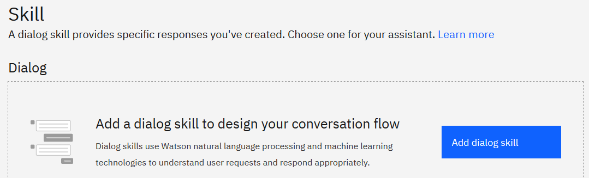
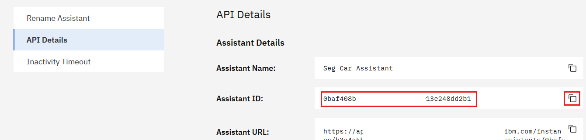

# Integración Watson APIs: Assistant v2 y Visual Recognition con Facebook Messenger
> For english instructions click [English](README_EN.md)
> 
> Presentación [APIS de Watson](https://ibm.box.com/v/watson-apis-ppt)

Esta aplicación demuestra una integración de las Watson APIs, conectando Facebook Messenger con Watson Assistant y Visual Recognition. Se desplegará en Cloud Foundry.

Cloud Foundry Public provee un web endpoint, para ser llamado por Facebook Messenger a través de su Webhook. El mensaje es enviado a Watson Assistant para interactuar con un asistente virtual, si el mensaje es una imagen es enviado a Watson Visual Recognition.

Después de terminar este taller usted entenderá como: 

* Usar Watson Assistant
* Usar Watson Visual Recognition
* Crear y Desplegar una aplicación Cloud Foundry 

<p align="center">
  
</p>


## Flujo

1. El usuario interactúa con Facebook Messenger
2. Facebook Messenger envía el payload a través del CF Endpoint
3. Se evalúa si el usuario tenía una sesión activa
4. Se envía el mensaje de texto a Watson Assistant.
5. Si es necesario, se envia una imagen adjunta a Watson Visual Recognition.
6. Se envía la respuesta a Facebook Messenger
7. El usuario obtiene la respuesta para su interacción.

## Componentes Incluidos

* [Watson Visual Recognition](https://www.ibm.com/watson/developercloud/visual-recognition): Visual Recognition usa algoritmos de deep learning para identificar escenas, objetos y rostros en una imagen. Puede crear y entrenar clasificadores customizados para identificar patrones para tus necesidades.
* [Watson Assistant](https://www.ibm.com/watson/developercloud/assistant): Watson Assistant service combina machine learning, natural language understanding e integra herramientas de dialogo para crear flujos conversacionales entre los usuarios y las aplicaciones.
* [Cloud Foundry Public](https://www.ibm.com/co-es/cloud/cloud-foundry) Ejecuta aplicaciones nativas de la nube, para levantarlas fácilmente y escalar potentemente y para gestionar el tráfico. El consumo se mide por horas y cambia dinámicamente según el uso.

## Tecnologías Importantes

* [Watson](https://www.ibm.com/watson/developer/): Watson en IBM Cloud permite integrar herramientas de AI en tu aplicación y guardar, entrenar y manejar tu data en una nube segura.
* [Api REST](https://www.ibm.com/support/knowledgecenter/es/SSMKHH_10.0.0/com.ibm.etools.mft.doc/bi12017_.htm): Cualquier interfaz entre sistemas que use HTTP para obtener datos o generar operaciones sobre esos datos en todos los formatos posibles, como XML y JSON.

## Prerrequisitos

* [Cloud Foundry CLI commands](https://cloud.ibm.com/docs/cloud-foundry-public?topic=cloud-foundry-public-deployingapps&locale=es#dep_apps)   IBM Cloud proporciona paquetes de compilación que admiten Java y Node.js, entre otros. Si está utilizando estos lenguajes y marcos, no necesita especificar el paquete de compilación cuando implemente su aplicación utilizando la interfaz de línea de comandos. Debido a que IBM Cloud está construido en Cloud Foundry, el comando está predeterminado en estos paquetes de compilación.

## Paso a Paso

### 1. Clonar o descargar el repo

Clone el repositorio `fb-watson-v2` localmente. Si es en una terminal, ejecute:

```
$ git clone https://github.com/ricardonior29/fb-watson-v2
```

### 2. Crear el servicio Watson Assistant

Cree un servicio de Watson Assistant desde el [catalogo de servicios de IBM Cloud](https://cloud.ibm.com/catalog):

<p align="left">
  
</p>

* Copie la **clave de API** y el **URL** del apartado de credenciales y péguelos en el archivo `params.json` en los valores `wa_api_key` y `wa_url`:

<p align="left">
  
</p>


* Click en el botón **Iniciar Watson Assistant** en la página principal del servicio y cree un nuevo asistente:

<p align="left">
  
</p>

* Cree un nuevo Dialog Skill en el lenguaje preferido o importe el ejemplo en español [sample_skill.json]:(sample_skill.json) 




> Si quiere crear su propio asistente virtual siga [estas instrucciones detalladas](README_Skills.md)

* Después de importar y/o desarrollar el asistente, vaya a **Settings**  en la esquina superior derecha del Asistente (No del Dialog Skill):


* En la sección de **API Details** copie el **Assistand ID** y péguelo en el archivo `params.json` en el valor `wa_assistant_id`:



### 3. Crear el servicio Watson Visual Recognition

Cree un servicio de Watson Visual Recognition desde el [catalogo de servicios de IBM Cloud](https://cloud.ibm.com/catalog)

* Copie la **clave de API** y el **URL** del apartado de credenciales y péguelos en el archivo `params.json` en los valores `vr_api_key` y `vr_url`
* Click en el botón **Iniciar Watson Studio** en la página principal del servicio
> Siga las instrucciones detalladas de como entrenar un modelo de clasificación de imagenes en [El Instructivo para Classify Images Model](README_CM.md)

### 4. Configurar Facebook Messenger

* Cree una Pagina en [Facebook](https://www.facebook.com/) como un Negocio o Marca.
* Use un nombre único y fácil de buscar.
* Si aun no la tiene, cree una cuenta en [Facebook Developers](https://developers.facebook.com/)
* Agregue una aplicación:


* Agregue a la aplicación el producto **Messenger** haciendo click en Configurar:


* Una vez configurada vaya a la sección **Tokens de acceso** y seleccione **Agregar o eliminar páginas**. Seleccione la página creada anteriormente.
* Seleccione **Generar Token** y copie el Token de acceso a la página de Facebook. Péguelo en el archivo `params.json` en el valor `fb_page_access_token`
* Finalmente, en el archivo `params.json` en el valor `fb_verification_token` defina una contraseña propia para su aplicación.

### 6. Desplegar a Cloud Foundry

#### 6.1 Instalar la CLI de IBM Cloud


*  Utilice un navegador para acceder al repositorio oficial de GitHub [`ibm-cloud-cli-releases`](https://github.com/IBM-Cloud/ibm-cloud-cli-release/releases/) y **seleccione** el instalador de su sistema operativo para comenzar la descarga. 
    
* Ejecute el instalador:
    -   Para Mac y Windows™, ejecute el instalador.
    -   Para Linux™, extraiga el paquete y ejecute el script `install`.
    
#### 6.2 Iniciar sesión en IBM Cloud

>Para facilitar el inicio de sesión al CLI siga los siguientes pasos. O si desea ver más formas de iniciar sesión en la CLI siga [esta documentación](https://cloud.ibm.com/docs/iam/federated_id?topic=iam-federated_id&locale=es#federated_id)

* Abra una terminal en su sistema operativo o en el IDE que este usando.
* Especifique la opción `--sso` con el comando`ibmcloud login`.
```
$ ibmcloud login --sso
```
* Siga el URL en la solicitud para obtener un código de acceso de un solo uso.
*   Copie y pegue el valor del código de acceso en la CLI como su entrada. (El código no será visible en la terminal).
* La sesión habrá iniciado.
* Para acceder a los servicios de Cloud Foundry especifique una organización y un espacio de Cloud Foundry. Puede ejecutar el siguiente comando para identificar la organización y el espacio de forma interactiva:
```
$ ibmcloud target --cf
```
O si conoce a qué organización y espacio pertenece el servicio, puede utilizar el siguiente comando:
```
$ ibmcloud target -o <value> -s <value>
```
> 
#### 6.3 Desplegar 

El siguiente método despliega a Cloud Foundry con un comando usando el archivo `manifest.yaml` (raíz del directorio) que especifica el ambiente de despliegue y nombre de la aplicación.
Asegúrate tener los parámetros correctos en el archivo `params.json`. 

```
$ ibmcloud cf push
```

> Si quieres deshacer el despliegue puedes usar `ibmcloud cf delete app-name`
> Si quieres ver los logs en consola `ibmcloud cf logs app-name --recent`

[Desplegar usando el App Manifest](https://docs.cloudfoundry.org/devguide/deploy-apps/manifest.html).

### 7. Configurar el Webhook de Facebook Messenger

* Copia el Endpoint público de la app desplegada en Cloud Foundry
* En el sitio de la aplicación de Facebook Messenger ve a la sección **Webhooks**
* Haz click en **Configurar Webhook**
* En el panel desplegable, pega el Endpoint de tu función. Modifica la extensión de la url, añadiendo al final de la dirección `/webhook`
* En el campo _Verificar Token_ ingresa la contraseña que definiste en el valor de `fb_verification_token` del archivo `params.json`
* En los _Campos de Suscripción_ selecciona la opción **messages**
* Crea el Webhook.
* En _Select a page to subscribe your webhook to the page events_ suscribe la página que se creó.

### 8. Prueba del Asistente Virtual
Buscar en la sección de mensajes la página e iniciar una conversación (desde la cuenta de la persona con la que se creó la página).

> Facebook Developer crea todas las aplicaciones por defecto como una aplicación de pruebas, si deseas publicar la aplicación para que cualquier persona pueda chatear con tu asistente virtual debes seguir los [procesos de revisión](https://developers.facebook.com/docs/apps/review/).
